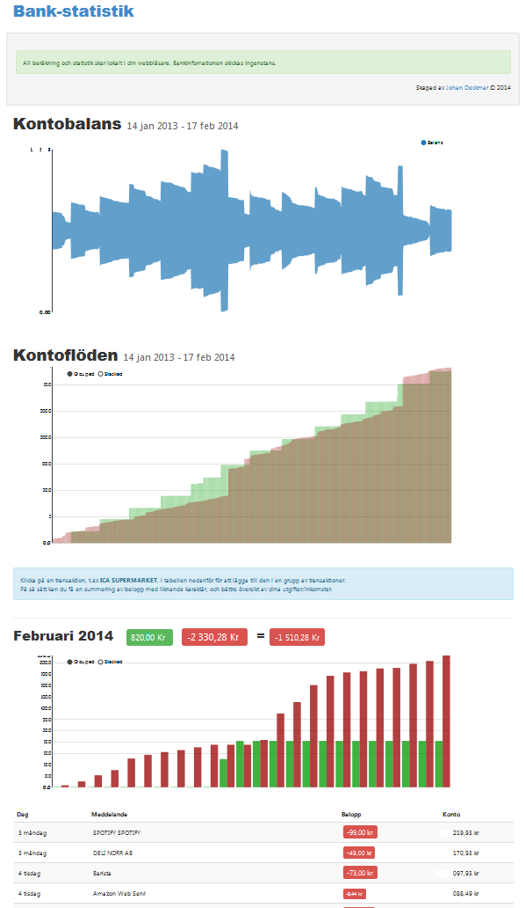

Bank Statistics
==============
This is the source code for a web application called Bank Statistics.

Bank Statistics allows you to copy&paste in your bank history, and it will summarize your income and expenses over time. It can clump together recurring expenses and makes graphical plots of how your account balance changes over months and years.

